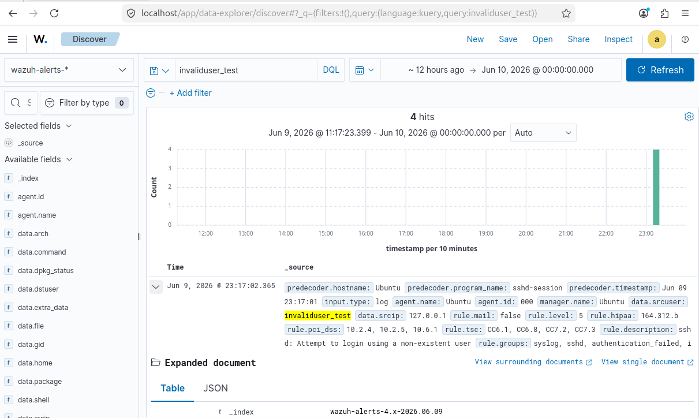
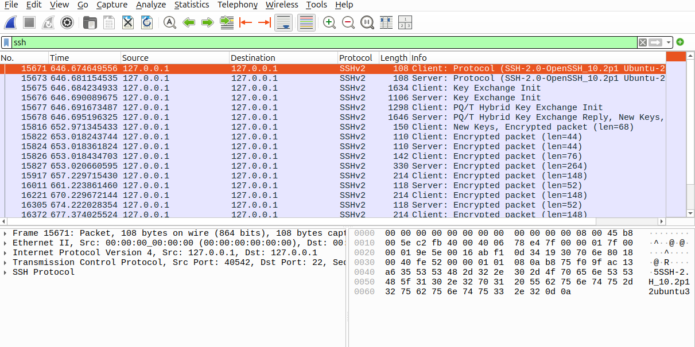

# Host-Based Threat Detection & Network Packet Analysis Lab

## Executive Summary
A simulated authentication attack was executed against a Linux local node to validate endpoint logging capabilities within the Wazuh SIEM/XDR platform and cross-examine network traffic anomalies using Wireshark. The objective was to successfully log, analyze, and document an unauthorized access attempt mimicking automated credential probing.

## Topology & Tools
- **Operating System:** Ubuntu Linux VM
- **SIEM Engine:** Wazuh Architecture (Single-Node Stack)
- **Network Analyzer:** Wireshark Packet Inspection
- **Targeted Protocol:** SSH (Port 22)

---

## Phase 1: Host-Based Log Telemetry (Wazuh SIEM)
Upon executing an unauthenticated access sequence targeting non-existent system accounts, the Wazuh analysis engine successfully triggered an Alert Level 5 security flag. This event correlates directly with **MITRE ATT&CK Technique T1110 (Brute Force)**.

### Telemetry Evidence

**Key Forensic Data Extracted:**
- **Triggered Policy:** SSHD Attempt to login using a non-existent user
- **Targeted Account:** `invaliduser_test`
- **Source IP Address:** `127.0.0.1` (Local loopback verification)
- **Alert Level:** 5 (Security anomaly verified)

---

## Phase 2: Deep Packet Forensic Investigation (Wireshark)
To cross-reference host logs with raw network data, the packet capture stream was isolated using the display filter string `ssh`. 

### Packet Analysis Evidence

**Forensic Findings:**
The network layer directly mirrors the endpoint telemetry. The packet analysis shows an accelerated sequence of raw TCP handshakes and key exchange initializations targeting Port 22. The automated nature of the connection requests—occurring systematically within milliseconds—indicates non-human script activity rather than a standard user authentication error.

## Lab Artifacts
The raw cryptographic packet capture file generated during this interactive threat hunting loop is preserved below:
- [Download Raw Forensic Artifact (ssh_brute_force.pcap)](ssh_brute_force.pcapng)
